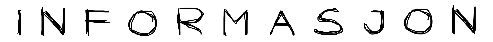

<body style="font-family:monospace;">


Utforsk og sammenlikn [Vinmonopolets](https://www.vinmonopolet.no) utvalg og prisendringer.

<div style="text-align: center;">
    
</div>

---


For å kjøre Python-versjonen av `vinskraper`, beveger du deg først til riktig mappe:

```bash
cd python
```

For å kunne kjøre applikasjonen lokalt må de nødvendige pakkene installeres. Dette gjøres ved å kjøre;

```bash
pip install -r requirements.txt
```

i terminalen. Deretter åpnes applikasjonen med

```bash
writer run vinskraper
```

fra terminalen.


For å kjøre Rust-versjonen av `vinskraper`, beveger du deg først til riktig mappe:

```bash
cd rust
```

_Under arbeid._

---



Dersom ingen data finnes fra før av, vil programmet automatisk hente ny data for den valgte 
kategorien. 

For historikkens skyld, lagres all hentet data i respektive `parquet`-filer. Dersom disse 
slettes vil ikke tilbud kunne utreknes (iom. at de baseres på historisk pris).

Dersom historisk data eksisterer (i kategoriens respektive `parquet`-fil), vil den nye prisen 
bli lagt til som en egen kolonne. Alle pris-kolonner har datoen de ble hentet som _suffix_.

---

</body>